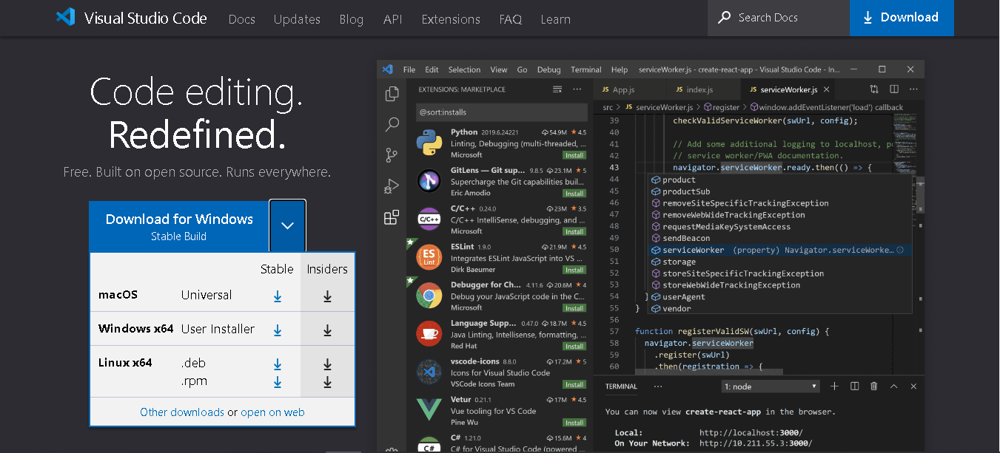

# Lévantate y corre

## Instrucciones

En esta tarea no calificada, debe repasar Python y hacer que su entorno esté en funcionamiento y sea capaz de ejecutar notebooks.

Tome esta [Ruta de aprendizaje de Python](https://docs.microsoft.com/learn/paths/python-language/?WT.mc_id=academic-77952-leestott), y luego configure sus sistemas con estos videos introductorios:

https://www.youtube.com/playlist?list=PLlrxD0HtieHhS8VzuMCfQD4uJ9yne1mE6

## Preparar entorno de trabajo
Para comenzar a crear un notebook, se debe tener el siguiente software (programas) instalados en la computadora:

- Python
- Visual Studio Code
- Extensión Jupyter de Visual Studio Code

### Instalación de Python

Como primer intruccion se debe descargar Python, si no lo tienes instalado dirígete a la siguiente dirección [Python.org](https://www.python.org/downloads/) para instalar la última versión compatible con tu sistema operativo.

Si ya se tiene Python instalado, es posible que debas actualizar la instalación a la versión más reciente. Puedes verificarlo al abrir la terminal (cmd):

* En windows: Presiona la tecla windows, posteriormente escribe 'cmd' o 'Simbolo del sistema' ejecutalo como administrador o simplemente presiona enter para que se ejecute.
* En Mac: Finder - Terminal - Enter
  Posteriormente escribe el siguiente comando:

``python --version``

Al ejecutar el comando se mostrará la versión que tienes actualmente instalada, se recomienda que la version sea a partir de la 3 en adelante.

### Instalación de Visual Studio Code

Instala Visual Studio Code. Para ello dirígete a la siguiente dirección [Visual Studio Code](https://code.visualstudio.com/), selecciona el sistema operativo de tu computadora.

Cuando esta se complete VSCode se puede configurar al gusto del usuario.

### Instalación de la extensión de Jupyter

Esta extensión permite ejecutar notebooks de Jupyter desde Visual Studio Code mediante un [Kernel](https://es.wikipedia.org/wiki/N%C3%BAcleo_(inform%C3%A1tica)). Un kernel en Visual Studio Code le ayuda a activar un entorno de [Anaconda](https://www.anaconda.com), por lo que puede ejecutar sus notebooks mediante la instalación de Python.

En Visual Studio Code, en el panel de extensiones de la izquierda, busque Jupyter de Microsoft. Para instalar esta extensión, seleccione Instalar.

Ahora ya se tiene configurado los tres elementos del área de trabajo, con esto ya se puede empezar a trabajar con los notebooks de Jupyter en Visual Studio Code.

#### Esta es la evidencia que corresponde a la <a href="https://github.com/microsoft/ML-For-Beginners/blob/main/1-Introduction/1-intro-to-ML/translations/assignment.es.md">tarea</a> de la lección <a href="https://github.com/microsoft/ML-For-Beginners/blob/main/1-Introduction/1-intro-to-ML/translations/README.es.md">Introducción al machine learning</a> del curso <a href="https://github.com/microsoft/ML-For-Beginners/tree/main"> MACHINE LEARNING FOR BEGINNERS</a> de Microsoft.