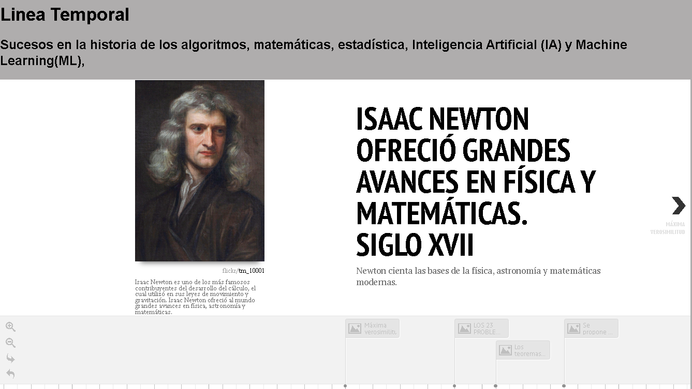

# Linea temporal

<strong>Sucesos historicos:</strong>

- <a href="https://aeac.science/actividad/newton/">ISAAC NEWTON OFRECIÓ GRANDES AVANCES EN FÍSICA Y MATEMÁTICAS - SIGLO XVII</a>
- <a href="https://es.wikipedia.org/wiki/M%C3%A1xima_verosimilitud">MÁXIMA VEROSIMILITUD - 1920</a>
- <a href="http://matematicosoriano.blogspot.com/2018/04/los-23-problemas-de-hilbert.html">LOS 23 PROBLEMAS DE HILBERT - 1928</a>
- <a href="https://www.gaussianos.com/que-dice-exactamente-el-primer-teorema-de-incompletitud-de-godel/">LOS TEOREMAS DE INCOMPLETITUD DE GÖDEL, TEORÍA DE CONJUNTOS - 1931</a>
- <a href="https://www.gaussianos.com/que-dice-exactamente-el-primer-teorema-de-incompletitud-de-godel/">SE PROPONE LA MÁQUINA DE TURING, EN LA TEORÍA DE LA COMPUTACIÓN - 1936</a>
- <a href="https://academia-lab.com/enciclopedia/algoritmo-de-busqueda-binaria/">DESARROLLO DEL ALGORITMO DE BÚSQUEDA BINARIA - 1946</a>
- <a href="https://bookdown.org/aquintela/EBE/la-teoria-de-test-de-hipotesis-de-neyman-pearson.html">LA TEORÍA DE TEST DE HIPÓTESIS DE NEYMAN Y PEARSON - 1950</a>
- <a href="https://www.bbc.com/news/technology-18475646">ALAN TURING: EL EXPERIMENTO QUE DIO FORMA A LA INTELIGENCIA ARTIFICIAL - 1950</a>
- <a href="https://ciberseguridad.com/guias/nuevas-tecnologias/machine-learning/perceptron/">FRANK ROSENBLATT DESARROLLA EL PERCEPTRÓN - 1956</a>
- <a href="https://www.biografias.es/famosos/donald-michie.html">DONALD MICHIE DESARROLLA 'MACHINE EDUCABLE NOUGHTS AND CROSSES ENGINE'(MENACE) - 1960</a>
- <a href="https://www.elmundo.es/ciencia-y-salud/2017/09/08/59b15eae468aebf67d8b4593.html">DESARROLLO DE LA TEORÍA DE CONJUNTOS BORROSOS POR LOTFI ZADEH - 1965</a>
- <a href="https://www.ibm.com/mx-es/topics/neural-networks">SE POPULARIZA EL USO DE REDES NEURONALES ARTIFICIALES - 1980</a>
- <a href="https://www.lavanguardia.com/vida/junior-report/20210210/6234712/kasparov-deep-blue-maquina-vencio-hombre.html">LA COMPUTADORA IBM'S DEEP BLUE DERROTA AL CAMPEÓN DE AJEDREZ GARRY KASPAROV - 1996</a>
- <a href="http://www.scielo.edu.uy/scielo.php?script=sci_arttext&pid=S2393-67972020000200004">MODELOS EPIDEMIOLÓGICOS EN LA PANDEMIA POR SARS-COV-2 - 2020</a>
- <a href="https://www.bbva.com/es/pe/innovacion/criptomonedas-o-bitcoin-que-son-las-monedas-digitales/">LAS CRIPTOMONEDAS GENERAN INTERÉS EN ALGORITMOS DE CRIPTOGRAFÍA Y BLOCKCHAIN - 2021</a>
- <a href="https://yoel-gasca.github.io/Machine-Learning-Lesons/1-Introduccion/2-Historia-de-ML/TimeLine/">GPT3, DESARROLLADO POR OPENAI, ES UNO DE LOS SISTEMAS DE IA MÁS IMPORTANTES HASTA EL MOMENTO - 2021</a>

<h3><a href="https://yoel-gasca.github.io/Machine-Learning-Lesons/1-Introduccion/2-Historia-de-ML/Historia-ML/TimeLine">Linea temporal</a></h3>

#### Esta es la evidencia que corresponde a la <a href="https://github.com/microsoft/ML-For-Beginners/blob/main/1-Introduction/2-history-of-ML/translations/assignment.es.md">tarea</a> de la lección <a href="https://github.com/microsoft/ML-For-Beginners/blob/main/1-Introduction/2-history-of-ML/translations/README.es.md">Historia del machine learning</a> del curso <a href="https://github.com/microsoft/ML-For-Beginners/tree/main"> MACHINE LEARNING FOR BEGINNERS</a> de Microsoft.
