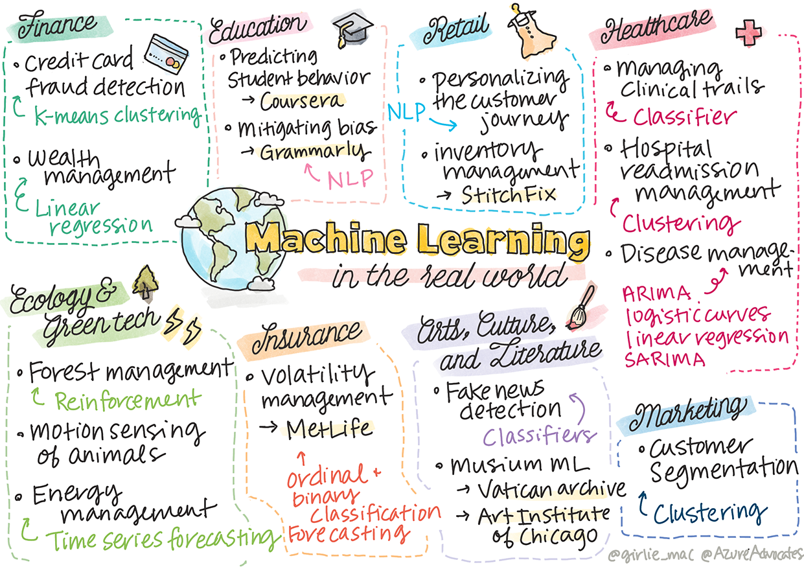

# Posdata: aprendizaje automático en el mundo real

Si bien la IA, que generalmente aprovecha el aprendizaje profundo, ha despertado mucho interés en la industria, todavía existen aplicaciones valiosas para los modelos clásicos de aprendizaje automático. ¡Incluso podrías utilizar algunas de estas aplicaciones hoy! En esta lección, se explorará cómo ocho industrias y dominios temáticos diferentes utilizan este tipo de modelos para hacer que sus aplicaciones sean más eficientes, confiables, inteligentes y valiosas para los usuarios.

## 💰 Finanzas

El sector financiero ofrece muchas oportunidades para el aprendizaje automático. Muchos problemas en esta área se prestan a ser modelados y resueltos mediante el uso de ML.

### Detección de fraude con tarjetas de crédito
Aprendimos sobre la agrupación de [K-MEANS](https://github.com/microsoft/ML-For-Beginners/blob/main/5-Clustering/2-K-Means/translations/README.es.md) anteriormente en el curso, pero ¿cómo se puede utilizar para resolver problemas relacionados con el fraude con tarjetas de crédito?

La agrupación de K-MEANS resulta útil durante una técnica de detección de fraude con tarjetas de crédito llamada detección de valores atípicos . Los valores atípicos, o desviaciones en las observaciones sobre un conjunto de datos, pueden indicarnos si una tarjeta de crédito se está utilizando de forma normal o si está sucediendo algo inusual. Como se muestra en el documento vinculado a continuación, puede ordenar los datos de las tarjetas de crédito utilizando un algoritmo de agrupamiento de k-medias y asignar cada transacción a un grupo en función de qué tan atípico parece ser. Luego, puede evaluar los grupos más riesgosos para detectar transacciones fraudulentas versus transacciones legítimas.

### Gestión de patrimonios
En la gestión patrimonial, una persona o una empresa gestiona las inversiones en nombre de sus clientes. Su trabajo es mantener y aumentar la riqueza a largo plazo, por lo que es esencial elegir inversiones que tengan un buen desempeño.

Una forma de evaluar el rendimiento de una inversión en particular es mediante regresión estadística. [La regresión lineal](https://github.com/microsoft/ML-For-Beginners/blob/main/2-Regression/1-Tools/translations/README.es.md) es una herramienta valiosa para comprender el rendimiento de un fondo en relación con algún índice de referencia. También podemos deducir si los resultados de la regresión son estadísticamente significativos o no, o en qué medida afectarían las inversiones de un cliente. Podría incluso ampliar aún más su análisis utilizando la regresión múltiple, donde se pueden tener en cuenta factores de riesgo adicionales. Para ver un ejemplo de cómo funcionaría esto para un fondo específico, consulte el documento a continuación sobre la evaluación del rendimiento del fondo mediante regresión.

## 🎓 Educación

El sector educativo también es un área muy interesante donde se puede aplicar el ML. Hay problemas interesantes que abordar, como detectar trampas en exámenes o ensayos o gestionar los sesgos, involuntarios o no, en el proceso de corrección.

### Predecir el comportamiento de los estudiantes
[Coursera](https://www.coursera.org/), un proveedor de cursos abiertos en línea, tiene un excelente blog de tecnología donde analizan muchas decisiones de ingeniería. En este estudio de caso, trazaron una línea de regresión para intentar explorar cualquier correlación entre una calificación NPS (Net Promoter Score) baja y la retención o abandono del curso.

### Mitigar el sesgo
[Grammarly](https://www.grammarly.com/), un asistente de escritura que verifica errores ortográficos y gramaticales, utiliza sofisticados [sistemas de procesamiento del lenguaje natural](../../6-NLP/README.md) en todos sus productos. Publicaron un interesante estudio de caso en su blog de tecnología sobre cómo abordaron el sesgo de género en el aprendizaje automático, que conoció en nuestra [lección introductoria sobre equidad](https://github.com/microsoft/ML-For-Beginners/blob/main/1-Introduction/3-fairness/README.md)

## 👜 Venta al por menor

El sector minorista definitivamente puede beneficiarse del uso de ML, con todo, desde crear un mejor recorrido del cliente hasta almacenar el inventario de manera óptima.

### Personalizando el recorrido del cliente
En Wayfair, una empresa que vende artículos para el hogar como muebles, es primordial ayudar a los clientes a encontrar los productos adecuados a sus gustos y necesidades. En este artículo, los ingenieros de la empresa describen cómo utilizan el aprendizaje automático y la PNL para "mostrar resultados adecuados a los clientes". En particular, su Query Intent Engine se ha creado para utilizar extracción de entidades, capacitación de clasificadores, extracción de activos y opiniones, y etiquetado de sentimientos en las reseñas de los clientes. Este es un caso de uso clásico de cómo funciona la PNL en el comercio minorista en línea. 

### La gestión del inventario
Empresas innovadoras y ágiles como [StitchFix](https://www.stitchfix.com/) , un servicio de cajas que envía ropa a los consumidores, dependen en gran medida del aprendizaje automático para recomendaciones y gestión de inventario. De hecho, sus equipos de estilismo trabajan junto con sus equipos de merchandising: "uno de nuestros científicos de datos modificó un algoritmo genético y lo aplicó a la ropa para predecir cuál sería una prenda exitosa que no existe hoy. Lo llevamos a el equipo de mercadería y ahora pueden usarlo como herramienta"

## 🏥 Cuidado de la salud

El sector de la atención médica puede aprovechar el aprendizaje automático para optimizar las tareas de investigación y también problemas logísticos como readmitir pacientes o detener la propagación de enfermedades.

### Gestión de ensayos clínicos
La toxicidad en los ensayos clínicos es una gran preocupación para los fabricantes de medicamentos. ¿Cuánta toxicidad es tolerable? En este estudio, el análisis de varios métodos de ensayos clínicos condujo al desarrollo de un nuevo enfoque para predecir las probabilidades de los resultados de los ensayos clínicos. Específicamente, pudieron utilizar un bosque aleatorio para producir un clasificador capaz de distinguir entre grupos de drogas.

### Gestión de reingresos hospitalarios
La atención hospitalaria es costosa, especialmente cuando los pacientes deben ser readmitidos. Este artículo analiza una empresa que utiliza ML para predecir el potencial de readmisión mediante [algoritmos de agrupación](../../5-Agrupamiento/README.md). Estos grupos ayudan a los analistas a "descubrir grupos de reingresos que pueden compartir una causa común".

### Manejo de enfermedad
La reciente pandemia ha arrojado luz sobre las formas en que el aprendizaje automático puede ayudar a detener la propagación de enfermedades. En este artículo, reconocerá el uso de ARIMA, curvas logísticas, regresión lineal y SARIMA. "Este trabajo es un intento de calcular la tasa de propagación de este virus y así predecir las muertes, las recuperaciones y los casos confirmados, de modo que pueda ayudarnos a prepararnos mejor y sobrevivir".

## 🌲 Ecología y tecnología verde

La naturaleza y la ecología constan de muchos sistemas sensibles en los que se centra la interacción entre los animales y la naturaleza. Es importante poder medir estos sistemas con precisión y actuar adecuadamente si ocurre algo, como un incendio forestal o una disminución de la población animal.

### Gestión de bosques
Aprendió sobre el [aprendizaje por refuerzo](../../8-Reforzamiento/1-QLearning/notebook.ipynb) en lecciones anteriores. Puede resultar muy útil al intentar predecir patrones en la naturaleza. En particular, puede utilizarse para rastrear problemas ecológicos como incendios forestales y la propagación de especies invasoras. En Canadá, un grupo de investigadores utilizó el aprendizaje por refuerzo para construir modelos de dinámica de incendios forestales a partir de imágenes de satélite. Utilizando un innovador "proceso de propagación espacial (SSP)", imaginaron un incendio forestal como "el agente en cualquier célula del paisaje". "El conjunto de acciones que el fuego puede tomar desde un lugar en cualquier momento incluye propagarse al norte, sur, este u oeste o no propagarse.

Este enfoque invierte la configuración habitual de RL, ya que la dinámica del correspondiente proceso de decisión de Markov (MDP) es una función conocida para la propagación inmediata de incendios forestales". Lea más sobre los algoritmos clásicos utilizados por este grupo en el siguiente enlace.

### Detección de movimiento de animales.
Si bien el aprendizaje profundo ha creado una revolución en el seguimiento visual de los movimientos de los animales (puedes crear tu propio [rastreador de osos polares](https://learn.microsoft.com/es-mx/training/modules/build-ml-model-with-azure-stream-analytics/?WT.mc_id=academic-77952-leestott)), el aprendizaje automático clásico todavía tiene un lugar en esta tarea.

Los sensores para rastrear los movimientos de los animales de granja y el IoT utilizan este tipo de procesamiento visual, pero las técnicas de aprendizaje automático más básicas son útiles para preprocesar los datos. Por ejemplo, en este artículo, se monitorearon y analizaron las posturas de las ovejas utilizando varios algoritmos clasificadores. Quizás reconozcas la curva ROC en la página 335.

## ⚡️ Gestión de energía
En nuestras lecciones sobre [pronóstico de series de tiempo](../../7-Timeseries/README.md), invocamos el concepto de parquímetros inteligentes para generar ingresos para una ciudad basándose en la comprensión de la oferta y la demanda. Este artículo analiza en detalle cómo la agrupación, la regresión y la previsión de series temporales se combinaron para ayudar a predecir el uso futuro de energía en Irlanda, basándose en la medición inteligente.

## 💼 Seguro
El sector de seguros es otro sector que utiliza ML para construir y optimizar modelos financieros y actuariales viables.

### Gestión de la volatilidad
MetLife, un proveedor de seguros de vida, muestra la forma en que analiza y mitiga la volatilidad en sus modelos financieros. En este artículo observará visualizaciones de clasificación binaria y ordinal. También descubrirá visualizaciones de pronóstico.

## 🎨 Arte, Cultura y Literatura
En las artes, por ejemplo en el periodismo, hay muchos problemas interesantes. Detectar noticias falsas es un gran problema, ya que se ha demostrado que influyen en la opinión de las personas e incluso derriban democracias. Los museos también pueden beneficiarse del uso del ML en todo, desde encontrar vínculos entre artefactos hasta la planificación de recursos.

### Detección de noticias falsas
Detectar noticias falsas se ha convertido en un juego del gato y el ratón en los medios actuales. En este artículo, los investigadores sugieren que se puede probar un sistema que combine varias de las técnicas de ML que hemos estudiado y desplegar el mejor modelo: "Este sistema se basa en el procesamiento del lenguaje natural para extraer características de los datos y luego estas características se utilizan para la entrenamiento de clasificadores de aprendizaje automático como Naive Bayes, Support Vector Machine (SVM), Random Forest (RF), Stochastic Gradient Descent (SGD) y Logistic Regression (LR)". 

Este artículo muestra cómo la combinación de diferentes dominios de ML puede producir resultados interesantes que pueden ayudar a evitar que las noticias falsas se propaguen y generen daños reales; en este caso, el impulso fue la difusión de rumores sobre tratamientos de COVID que incitaban a la violencia colectiva

### Museo ML
Los museos están en la cúspide de una revolución de la IA en la que catalogar y digitalizar colecciones y encontrar vínculos entre artefactos se vuelve más fácil a medida que avanza la tecnología. Proyectos como [In Codice Ratio](https://www.sciencedirect.com/science/article/abs/pii/S0306457321001035#:~:text=1.,studies%20over%20large%20historical%20sources.) están ayudando a desbloquear los misterios de colecciones inaccesibles como los Archivos Vaticanos. Pero el aspecto comercial de los museos también se beneficia de los modelos de aprendizaje automático.

Por ejemplo, el Instituto de Arte de Chicago construyó modelos para predecir qué le interesa al público y cuándo asistirá a las exposiciones. El objetivo es crear experiencias de visitante individualizadas y optimizadas cada vez que el usuario visita el museo. "Durante el año fiscal 2017, el modelo predijo la asistencia y las admisiones con una precisión del 1 por ciento", dice Andrew Simnick, vicepresidente senior del Art Institute. 

## 🏷 Comercialización
Segmentación de clientes
Las estrategias de marketing más efectivas se dirigen a los clientes de diferentes maneras según diversos grupos. En este artículo, se analizan los usos de los algoritmos de agrupación en clústeres para respaldar el marketing diferenciado. El marketing diferenciado ayuda a las empresas a mejorar el reconocimiento de la marca, llegar a más clientes y ganar más dinero.