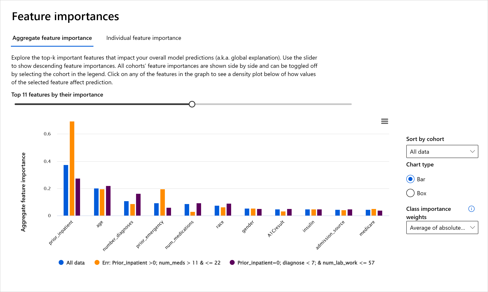

# Depuración de modelos en aprendizaje automático utilizando componentes de panel de control de IA responsable

## Introducción
El aprendizaje automático impacta nuestra vida cotidiana. La IA está llegando a algunos de los sistemas más importantes que nos afectan como individuos y a nuestra sociedad, desde la atención sanitaria, las finanzas, la educación y el empleo. Por ejemplo, los sistemas y modelos intervienen en las tareas diarias de toma de decisiones, como los diagnósticos sanitarios o la detección de fraude. En consecuencia, los avances en la IA, junto con la adopción acelerada, se enfrentan a expectativas sociales cambiantes y a una regulación cada vez mayor en respuesta. Constantemente vemos áreas donde los sistemas de IA siguen incumpliendo las expectativas; exponen nuevos desafíos; y los gobiernos están comenzando a regular las soluciones de IA. Por eso, es importante que estos modelos se analicen para proporcionar resultados justos, confiables, inclusivos, transparentes y responsables para todos.

En este plan de estudios, veremos herramientas prácticas que se pueden utilizar para evaluar si un modelo tiene problemas de IA responsables. Las técnicas tradicionales de depuración del aprendizaje automático tienden a basarse en cálculos cuantitativos, como la precisión agregada o la pérdida promedio de errores. Imagínese lo que puede suceder cuando los datos que está utilizando para construir estos modelos carecen de ciertos datos demográficos, como raza, género, opinión política, religión, o representan de manera desproporcionada dichos datos demográficos. ¿Qué pasa cuando se interpreta que el resultado del modelo favorece a algún grupo demográfico? Esto puede introducir una representación excesiva o insuficiente de estos grupos de características sensibles, lo que genera problemas de equidad, inclusión o confiabilidad del modelo. Otro factor es que los modelos de aprendizaje automático se consideran cajas negras, lo que dificulta comprender y explicar qué impulsa la predicción de un modelo. Todos estos son desafíos que enfrentan los científicos de datos y los desarrolladores de inteligencia artificial cuando no cuentan con las herramientas adecuadas para depurar y evaluar la imparcialidad o confiabilidad de un modelo.

En esta lección, aprenderá cómo depurar sus modelos usando:

Análisis de errores : identifique en qué parte de su distribución de datos el modelo tiene altas tasas de error.
Descripción general del modelo : realice análisis comparativos entre diferentes cohortes de datos para descubrir disparidades en las métricas de rendimiento de su modelo.
Análisis de datos : investigue dónde podría haber una representación excesiva o insuficiente de sus datos que pueda sesgar su modelo para favorecer un dato demográfico frente a otro.
Importancia de las funciones : comprenda qué funciones impulsan las predicciones de su modelo a nivel global o local.

El componente Análisis de errores en el panel RAI ilustra cómo se distribuyen las fallas del modelo entre varias cohortes con una visualización de árbol. Esto es útil para identificar características o áreas donde existe una alta tasa de error en su conjunto de datos. Al ver de dónde provienen la mayoría de las imprecisiones del modelo, puede comenzar a investigar la causa raíz. También puede crear cohortes de datos para realizar análisis. Estas cohortes de datos ayudan en el proceso de depuración para determinar por qué el rendimiento del modelo es bueno en una cohorte, pero erróneo en otra.

Los indicadores visuales en el mapa de árbol ayudan a localizar las áreas problemáticas más rápidamente. Por ejemplo, cuanto más oscuro sea el tono rojo de un nodo de árbol, mayor será la tasa de error.

El mapa de calor es otra funcionalidad de visualización que los usuarios pueden utilizar para investigar la tasa de error utilizando una o dos funciones para encontrar un contribuyente a los errores del modelo en todo un conjunto de datos o cohortes.

Utilice el análisis de errores cuando necesite:

Obtenga una comprensión profunda de cómo se distribuyen las fallas del modelo en un conjunto de datos y en varias dimensiones de entrada y características.
Desglose las métricas de rendimiento agregadas para descubrir automáticamente cohortes erróneas para informar sus pasos de mitigación específicos.

### Descripción general del modelo
Evaluar el desempeño de un modelo de aprendizaje automático requiere obtener una comprensión holística de su comportamiento. Esto se puede lograr revisando más de una métrica, como tasa de error, exactitud, recuperación, precisión o MAE (Mean Absolute Err) para encontrar disparidades entre las métricas de rendimiento. Una métrica de desempeño puede parecer excelente, pero las imprecisiones pueden quedar expuestas en otra métrica. Además, comparar las métricas de disparidades en todo el conjunto de datos o cohortes ayuda a arrojar luz sobre dónde el modelo está funcionando bien o no. Esto es especialmente importante para ver el desempeño del modelo entre características sensibles e insensibles (p. ej., raza, género o edad del paciente) para descubrir posibles injusticias que pueda tener el modelo. Por ejemplo, descubrir que el modelo es más erróneo en una cohorte que tiene características sensibles puede revelar una posible injusticia que pueda tener el modelo.

El componente Descripción general del modelo del panel RAI ayuda no solo a analizar las métricas de rendimiento de la representación de datos en una cohorte, sino que también brinda a los usuarios la capacidad de comparar el comportamiento del modelo entre diferentes cohortes.

La funcionalidad de análisis basada en características del componente permite a los usuarios limitar subgrupos de datos dentro de una característica particular para identificar anomalías a nivel granular. Por ejemplo, el panel tiene inteligencia incorporada para generar automáticamente cohortes para una función seleccionada por el usuario (por ejemplo, "time_in_hospital < 3" o "time_in_hospital >= 7" ). Esto permite al usuario aislar una característica particular de un grupo de datos más grande para ver si es un factor de influencia clave en los resultados erróneos del modelo.

El componente Descripción general del modelo admite dos clases de métricas de disparidad:

**Disparidad en el rendimiento del modelo**: estos conjuntos de métricas calculan la disparidad (diferencia) en los valores de la métrica de rendimiento seleccionada entre subgrupos de datos. Aquí están algunos ejemplos:

* Disparidad en la tasa de precisión
* Disparidad en la tasa de error
* Disparidad en precisión
* Disparidad en el recuerdo
* Disparidad en el error absoluto medio (MAE)

**Disparidad en la tasa de selección**: esta métrica contiene la diferencia en la tasa de selección (predicción favorable) entre los subgrupos. Un ejemplo de esto es la disparidad en las tasas de aprobación de préstamos. Tasa de selección significa la fracción de puntos de datos en cada clase clasificados como 1 (en clasificación binaria) o distribución de valores de predicción (en regresión).

### Análisis de los datos
> "Si torturas los datos el tiempo suficiente, confesarán cualquier cosa" - Ronald Coase

Esta afirmación suena extrema, pero es cierto que los datos pueden manipularse para respaldar cualquier conclusión. A veces, esta manipulación puede ocurrir sin querer. Como seres humanos, todos tenemos sesgos y, a menudo, es difícil saber conscientemente cuándo se están introduciendo sesgos en los datos. Garantizar la equidad en la IA y el aprendizaje automático sigue siendo un desafío complejo.

Los datos son un gran punto ciego para las métricas de rendimiento de los modelos tradicionales. Es posible que tenga puntuaciones de precisión altas, pero esto no siempre refleja el sesgo de datos subyacente que podría haber en su conjunto de datos. Por ejemplo, si un conjunto de datos de empleados tiene un 27% de mujeres en puestos ejecutivos en una empresa y un 73% de hombres en el mismo nivel, un modelo de IA de publicidad laboral entrenado con estos datos puede apuntar principalmente a una audiencia masculina para puestos de trabajo de nivel superior. Tener este desequilibrio en los datos sesgó la predicción del modelo para favorecer a un género. Esto revela una cuestión de equidad donde existe un sesgo de género en el modelo de IA.

El componente de análisis de datos en el panel RAI ayuda a identificar áreas donde hay una representación excesiva o insuficiente en el conjunto de datos. Ayuda a los usuarios a diagnosticar la causa raíz de los errores y problemas de equidad introducidos por desequilibrios de datos o falta de representación de un grupo de datos en particular. Esto brinda a los usuarios la capacidad de visualizar conjuntos de datos basados ​​en resultados reales y previstos, grupos de errores y características específicas. A veces, descubrir un grupo de datos subrepresentado también puede revelar que el modelo no está aprendiendo bien, de ahí las altas imprecisiones. Tener un modelo que tiene datos sesgados no es sólo una cuestión de equidad, sino que demuestra que el modelo no es inclusivo ni confiable.

Utilice el análisis de datos cuando necesite:

* Explore las estadísticas de su conjunto de datos seleccionando diferentes filtros para dividir sus datos en diferentes dimensiones (también conocidas como cohortes).
* Comprenda la distribución de su conjunto de datos en diferentes cohortes y grupos de características.
* Determine si sus hallazgos relacionados con la equidad, el análisis de errores y la causalidad (derivados de otros componentes del panel) son el resultado de la distribución de su conjunto de datos.
* Decida en qué áreas recopilar más datos para mitigar los errores que surgen de problemas de representación, ruido de etiquetas, ruido de características, sesgo de etiquetas y factores similares.

## Interpretabilidad del modelo
Los modelos de aprendizaje automático tienden a ser cajas negras. Comprender qué características clave de los datos impulsan la predicción de un modelo puede resultar un desafío. Es importante brindar transparencia sobre por qué un modelo hace una determinada predicción. Por ejemplo, si un sistema de inteligencia artificial predice que un paciente diabético corre el riesgo de ser readmitido en un hospital en menos de 30 días, debería poder proporcionar datos de respaldo que condujeron a su predicción. Tener indicadores de datos de respaldo aporta transparencia para ayudar a los médicos u hospitales a poder tomar decisiones bien informadas. Además, poder explicar por qué un modelo hizo una predicción para un paciente individual permite rendir cuentas con las normas sanitarias. Cuando se utilizan modelos de aprendizaje automático de formas que afectan la vida de las personas, es fundamental comprender y explicar qué influye en el comportamiento de un modelo. La explicabilidad e interpretabilidad del modelo ayudan a responder preguntas en escenarios como:

Depuración del modelo: ¿Por qué mi modelo cometió este error? ¿Cómo puedo mejorar mi modelo?
Colaboración humano-IA: ¿Cómo puedo entender y confiar en las decisiones del modelo?
Cumplimiento normativo: ¿Cumple mi modelo los requisitos legales?
El componente Importancia de funciones del panel RAI le ayuda a depurar y obtener una comprensión integral de cómo un modelo hace predicciones. También es una herramienta útil para que los profesionales del aprendizaje automático y los tomadores de decisiones expliquen y muestren evidencia de las características que influyen en el comportamiento de un modelo para el cumplimiento normativo. A continuación, los usuarios pueden explorar explicaciones globales y locales para validar qué características impulsan la predicción de un modelo. Las explicaciones globales enumeran las características principales que afectaron la predicción general de un modelo. Las explicaciones locales muestran qué características llevaron a la predicción de un modelo para un caso individual. La capacidad de evaluar explicaciones locales también es útil para depurar o auditar un caso específico para comprender e interpretar mejor por qué un modelo hizo una predicción precisa o inexacta.

* Explicaciones globales: por ejemplo, ¿qué características afectan el comportamiento general de un modelo de reingreso hospitalario para diabéticos?
* Explicaciones locales: Por ejemplo, ¿por qué se predijo que un paciente diabético mayor de 60 años con hospitalizaciones previas sería reingresado o no reingresado dentro de los 30 días de regreso a un hospital?

En el proceso de depuración de examinar el rendimiento de un modelo en diferentes cohortes, la Importancia de la característica muestra qué nivel de impacto tiene una característica en las cohortes. Ayuda a revelar anomalías al comparar el nivel de influencia que tiene la característica a la hora de impulsar las predicciones erróneas de un modelo. El componente Importancia de la característica puede mostrar qué valores de una característica influyeron positiva o negativamente en el resultado del modelo. Por ejemplo, si un modelo hizo una predicción inexacta, el componente le brinda la capacidad de profundizar e identificar qué características o valores de características impulsaron la predicción. Este nivel de detalle ayuda no sólo en la depuración sino que proporciona transparencia y responsabilidad en situaciones de auditoría. Finalmente, el componente puede ayudarle a identificar problemas de equidad. A modo de ejemplo, si una característica sensible, como la etnia o el género, influye mucho en la predicción de un modelo, esto podría ser un signo de sesgo de raza o género en el modelo.

Utilice la interpretabilidad cuando necesite:

* Determine qué tan confiables son las predicciones de su sistema de IA entendiendo qué características son más importantes para las predicciones.
* Acérquese a la depuración de su modelo comprendiéndolo primero e identificando si el modelo utiliza características saludables o simplemente correlaciones falsas.
* Descubra posibles fuentes de injusticia al comprender si el modelo basa sus predicciones en características sensibles o en características que están altamente correlacionadas con ellas.
* Genere confianza del usuario en las decisiones de su modelo generando explicaciones locales para ilustrar sus resultados.
* Complete una auditoría regulatoria de un sistema de IA para validar modelos y monitorear el impacto de las decisiones del modelo en los humanos.

## Conclusión
Todos los componentes del panel RAI son herramientas prácticas que le ayudarán a crear modelos de aprendizaje automático que sean menos dañinos y más confiables para la sociedad. Mejora la prevención del trato a los derechos humanos; discriminar o excluir a ciertos grupos de las oportunidades de vida; y el riesgo de sufrir daños físicos o psicológicos. También ayuda a generar confianza en las decisiones de su modelo al generar explicaciones locales para ilustrar sus resultados. Algunos de los daños potenciales se pueden clasificar como:

* Asignación , si por ejemplo se favorece un género o una etnia sobre otro.
* Calidad de servicio . Si entrena los datos para un escenario específico pero la realidad es mucho más compleja, el servicio tendrá un rendimiento deficiente.
* Estereotipos . Asociar un grupo determinado con atributos preasignados.
* Denigración . Criticar y etiquetar injustamente algo o alguien.
* Representación excesiva o insuficiente . La idea es que un determinado grupo no se ve en una determinada profesión, y cualquier servicio o función que siga promoviendo eso está contribuyendo al daño.

### Panel de control de Azure RAI
El [panel de Azure RAI](https://learn.microsoft.com/en-us/azure/machine-learning/concept-responsible-ai-dashboard?view=azureml-api-2&WT.mc_id=aiml-90525-ruyakubu) se basa en herramientas de código abierto desarrolladas por las principales instituciones y organizaciones académicas, incluido Microsoft, y es fundamental para que los científicos de datos y los desarrolladores de IA comprendan mejor el comportamiento del modelo, descubran y mitiguen problemas no deseados de los modelos de IA.

Aprenda a utilizar los diferentes componentes consultando los [documentos del panel RAI](https://learn.microsoft.com/en-us/azure/machine-learning/concept-responsible-ai-dashboard?view=azureml-api-2&WT.mc_id=aiml-90525-ruyakubu).

Consulte algunos [cuadernos de muestra del panel RAI](https://github.com/Azure/RAI-vNext-Preview/tree/main/examples/notebooks) para depurar escenarios de IA más responsables en Azure Machine Learning.

